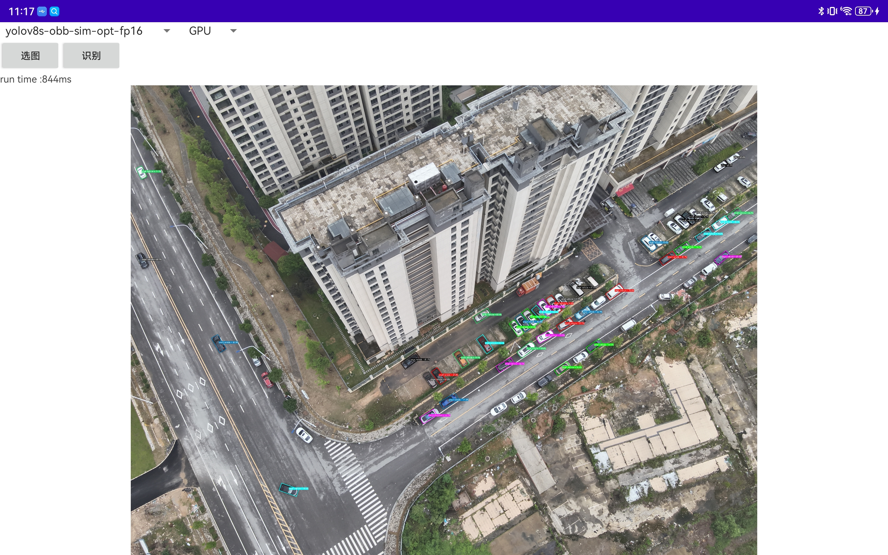

## ncnn-android-yolov8-obb

### 项目预览



## 如何使用自己训练的obb模型

### 1. 修改推导部分的代码

找到ultralytics\nn\modules\head.py
- 修改 class Detect(nn.Module):中的_inference函数
```python
def _inference(self, x):
        """Decode predicted bounding boxes and class probabilities based on multiple-level feature maps."""
        # Inference path
        shape = x[0].shape  # BCHW
        x_cat = torch.cat([xi.view(shape[0], self.no, -1) for xi in x], 2)
        if self.dynamic or self.shape != shape:
            self.anchors, self.strides = (x.transpose(0, 1) for x in make_anchors(x, self.stride, 0.5))
            self.shape = shape

        if self.export and self.format in {"saved_model", "pb", "tflite", "edgetpu", "tfjs"}:  # avoid TF FlexSplitV ops
            box = x_cat[:, : self.reg_max * 4]
            cls = x_cat[:, self.reg_max * 4 :]
        else:
            box, cls = x_cat.split((self.reg_max * 4, self.nc), 1)

        if self.export and self.format in {"tflite", "edgetpu"}:
            # Precompute normalization factor to increase numerical stability
            # See https://github.com/ultralytics/ultralytics/issues/7371
            grid_h = shape[2]
            grid_w = shape[3]
            grid_size = torch.tensor([grid_w, grid_h, grid_w, grid_h], device=box.device).reshape(1, 4, 1)
            norm = self.strides / (self.stride[0] * grid_size)
            dbox = self.decode_bboxes(self.dfl(box) * norm, self.anchors.unsqueeze(0) * norm[:, :2])
        else:
            dbox = self.decode_bboxes(self.dfl(box), self.anchors.unsqueeze(0)) * self.strides
        return x_cat if self.export else  torch.cat((dbox, cls.sigmoid()), 1)
```
- 修改class OBB(Detect):中的forward函数
 ```python
    def forward(self, x):
        """Concatenates and returns predicted bounding boxes and class probabilities."""
        bs = x[0].shape[0]  # batch size
        angle = torch.cat([self.cv4[i](x[i]).view(bs, self.ne, -1) for i in range(self.nl)], 2)  # OBB theta logits
        # NOTE: set `angle` as an attribute so that `decode_bboxes` could use it.
        angle = (angle.sigmoid() - 0.25) * math.pi  # [-pi/4, 3pi/4]
        # angle = angle.sigmoid() * math.pi / 2  # [0, pi/2]
        if not self.training:
            self.angle = angle
        x = Detect.forward(self, x)
        if self.training:
            return x, angle
        return torch.cat([x, angle], 1).permute(0, 2, 1) if self.export else (torch.cat([x[0], angle], 1), (x[1], angle))
```

重新安装修改后的代码

```bash
pip install -qe ultralytics
```

### 2. 导出模型

```bash
# pt 转 onnx
yolo export model=yolov8s-obb.pt format=onnx opset=11 simplify half=True
```
### 3. 用ncnn导出模型
ncnn[下载地址](https://github.com/Tencent/ncnn/releases/tag/20240410)

```bash
# pt 转 ncnn
onnx2ncnn yolov8s-obb.onnx yolov8s-obb.param yolov8s-obb.bin

# optimize half ncnn模型
ncnnoptimize yolov8s-obb.param yolov8s-obb.bin yolov8s-obb-sim-opt-fp16.param yolov8s-obb-sim-opt-fp16.bin 1
```


## 参考

https://github.com/nihui/opencv-mobile

https://github.com/Tencent/ncnn

https://github.com/FeiGeChuanShu/ncnn-android-yolov8
